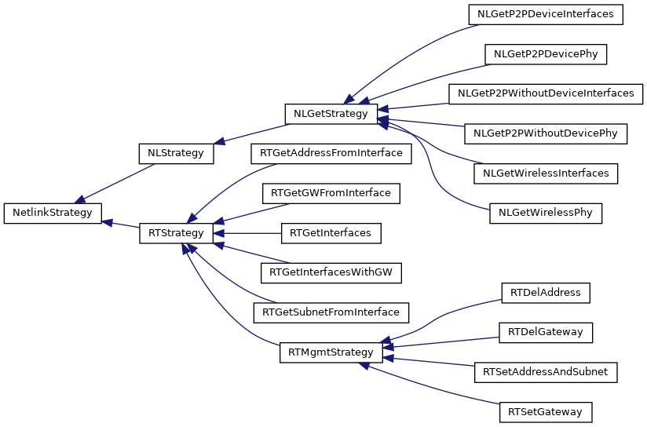

# Netlink handler class

This projects implements a class called Netlink to create a C++ API to handle requests and responses through the Netlink protocol.
Behind the main class (Netlink.class.hpp) reside different classes, which are specific handlers to execute commands and eventually read responses from the kernel.
This relation is implemented following the Pattern Strategy.  
The way netlink is used is basic and the code does not implement external library as libnl or libmnl - it just uses socket based on the Netlink protocol.

# Installation
1. Clone this repository
2. Go inside the directory  
```
cd netlink
```
3. Compile the project
```
cmake -B build .
cd build
make
```
4. Run

## Implemented functions
- *NETLINK_ROUTE protocol*
  1. Get all interfaces
  2. Get all interfaces with a default gateway set
  3. Get subnet from interface passed as argument
  4. Get address from interface passed as argument
  5. Get gateway from interface passed as argument
  6. Set address and subnet on specified interface
  7. Delete address on specified interface
  8. Set gateway on specified interface
  9. Delete gateway on specified interface  


- *NETLINK_GENERIC protocol*
  1. Get all Wireless Interfaces
  2. Get all Wi-Fi physical devices
  3. Get all Wi-Fi physical device supporting P2P-Device mode
  4. Get all Wi-Fi interfaces supporting P2P-Device mode
  5. Get all Wi-Fi physical devices supporting P2P without P2P-Device mode
  6. Get all Wi-Fi interfaces supporting P2P without P2P-Device mode

5. Documentation
You can build doxygen documentation by running doxy.sh script in doxygen directory.
```
    cd doxygen  
    bash doxy.sh
```

After that, you can browse the files inside the docs directory, or open a http server on localhost to browse files - just as an example:
```
    cd doxygen/docs/html
    python3 -m http.server
```

will open a webserver on your localhost, port 8000.


